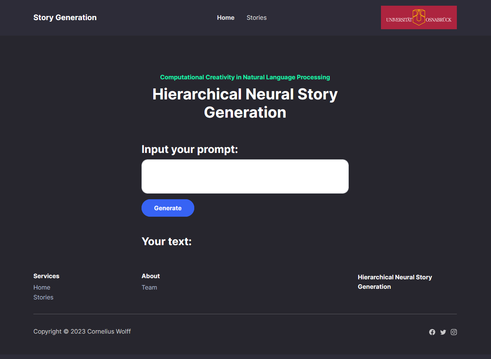

# Hierarchical Neural Story Generation
## Creativity in Natural Language Processing - Osnabrück University
This project was created as part of the Creativity in Natural Language Processing seminar at the _Osnabrück University, Germany_. It contains a simple implementation of the [Hierarchical Neural Story Generation](https://arxiv.org/abs/1805.04833) approach, including a Flask based web interface. he code regarding the ANNs largely extends the previous implementation by Mukherjee et all, which has been published on [GitHub](https://github.com/kevalnagda/StoryGeneration) by fixing multiple bugs and refining some of the implementation details.
<p align="right">(<a href="#top">back to top</a>)</p>

## 📖 Table of Contents
- [Hierarchical Neural Story Generation](#hierarchical-neural-story-generation)
  - [Creativity in Natural Language Processing - Osnabrück University](#creativity-in-natural-language-processing---osnabrück-university)
  - [📖 Table of Contents](#-table-of-contents)
  - [✨ Features](#-features)
  - [💻 Usage](#-usage)
  - [💾 Structure](#-structure)
  - [🚫 Limitations](#-limitations)
  - [📃 Paper](#-paper)
  - [📝 Authors](#-authors)
  - [📎 License](#-license)

## ✨ Features
<br/>
This repository has two main features. One is the ability to start the training process of the model based on costum data. Furthermore it provides a web interface for using the (pre)trained models in a nice environment that can handle multiple users at once. 
<br/>
<p align="center">

</p>
<p align="right">(<a href="#top">back to top</a>)</p>

## 💻 Usage
To use our code, you first have to install the requiered libraries from the requirements.txt.
 ```
  pip install -r requirements.txt
  ```
After this, you can train your own model.
 ```
  python3 storygeneration/train.py
  ```
If you want to use the model to generte stories, you can do so by starting the webinterface.
 ```
  python3 app.py
  ```
You can then access the web interface by simply typing the following link into your browser.
 ```
  127.0.0.1:5000/home
```
<p align="right">(<a href="#top">back to top</a>)</p>

## 💾 Structure
<!-- Project Structure -->

    .
    ├── static                  # Static files for the flask server
    │   └── ...
    ├── storygeneration         # All rlevant files for the ANN model
    │   └── ...
    ├── templates               # All html files for the web interface
    │   └── ...
    │── .gitattributes
    │── .gitignore
    │── app.py                  # Main file for flask based web interface
    │── data.py                 # Python interface for the database
    │── README.md
    └── requirements.txt
<p align="right">(<a href="#top">back to top</a>)</p>

## 🚫 Limitations
There are two main limitations with the implemented approach and the pretrained models:
- Very limited training dataset -> Questionable performance of the pretrained model
- Implementation uses a beam search approach, which according to the paper, results in a worse performance than top-k random sampling.
<p align="right">(<a href="#top">back to top</a>)</p>


## 📃 Paper
The paper "Hierarchical Neural Story Generation" has been published in 2018 by Fan, Lewis and Dauphin and had a significant impact on the field of text generation with artificial neural network.
<p align="right">(<a href="#top">back to top</a>)</p>

## 📝 Authors
[Cornelius Wolff](mailto:cowolff@uos.de)<br/>
[Verinda Ruzhdi Kondzheli](mailto:vkondzheli@uni-osnabrueck.de)<br/>
<p align="right">(<a href="#top">back to top</a>)</p>

## 📎 License
Copyright 2022 Cornelius Wolff

Licensed under the Apache License, Version 2.0 (the "License");
you may not use this file except in compliance with the License.
You may obtain a copy of the License at

    http://www.apache.org/licenses/LICENSE-2.0

Unless required by applicable law or agreed to in writing, software
distributed under the License is distributed on an "AS IS" BASIS,
WITHOUT WARRANTIES OR CONDITIONS OF ANY KIND, either express or implied.
See the License for the specific language governing permissions and
limitations under the License.
<p align="right">(<a href="#top">back to top</a>)</p>